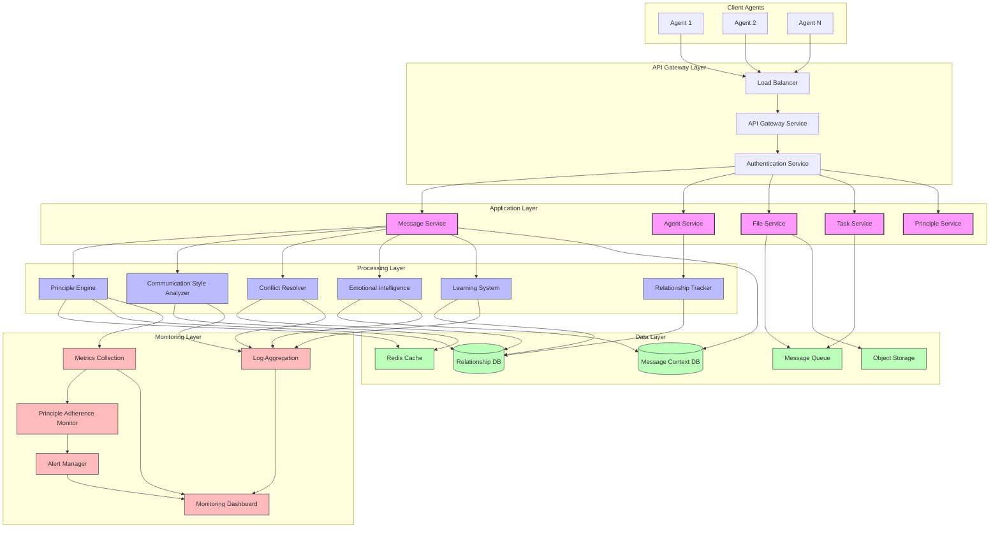

# Deployment Architecture for Adaptive Bridge Builder

## 1. Server Requirements

### Core Infrastructure

#### Application Servers
- **Primary Application Cluster**
  - **Compute Requirements**: 
    - CPU: Minimum 4 vCPUs per node (8 vCPUs recommended)
    - Memory: Minimum 8GB RAM per node (16GB recommended)
    - Storage: 100GB SSD for application code and local processing
  - **Scaling Parameters**: 
    - Initial deployment: 3-node cluster
    - Horizontal scaling based on message volume metrics
  - **Container Configuration**:
    - Base Image: Python 3.9+ on slim Debian
    - Resource Limits: 2-4 vCPUs, 4-8GB RAM per container
    - Health Checks: Endpoint monitoring with principle adherence validation

#### Database System
- **Relationship Storage**
  - Technology: PostgreSQL 14+
  - Storage Requirements: 250GB SSD (expandable)
  - Backup Schedule: Hourly incremental, daily full backups
  - Replication: Primary with standby replicas
  
- **Message Context Storage**
  - Technology: MongoDB 5.0+
  - Storage Requirements: 500GB SSD (expandable)
  - Sharding Strategy: Conversation ID based
  - Indexing: Agent IDs, conversation IDs, timestamps

#### File Exchange Storage
- **Object Storage**
  - Technology: S3-compatible object storage
  - Initial Capacity: 1TB
  - Access Pattern: High read, moderate write
  - Retention Policy: Configurable per relationship tier
  - Encryption: Server-side encryption with managed keys

### Supporting Services

#### Message Queue
- **Technology**: RabbitMQ or Apache Kafka
- **Configuration**:
  - Separate queues for different message priorities
  - Dead letter queues for failed message processing
  - Message persistence for guaranteed delivery
  - Topic-based routing for message categorization

#### Cache Layer
- **Technology**: Redis 6.2+
- **Configuration**:
  - Agent relationship cache (TTL: 1 hour)
  - Agent capability cache (TTL: 24 hours)
  - Communication style cache (TTL: 2 hours)
  - Session data cache (TTL: 4 hours)

#### Logging and Telemetry
- **Technology**: ELK Stack (Elasticsearch, Logstash, Kibana) or Datadog
- **Storage Requirements**: 200GB, retention based on regulatory requirements
- **Configuration**:
  - Structured logging with conversation IDs for correlation
  - Principle adherence metrics collection
  - Performance metrics for all API endpoints
  - Integration with alerting system

## 2. API Endpoints

### A2A Protocol Endpoints

#### Message Exchange Endpoints
- **POST /a2a/v1/messages**
  - Description: Primary endpoint for message exchange between agents
  - Request Body: JSON-RPC 2.0 formatted message
  - Response: Message processing result with metadata
  - Rate Limit: 1000 requests per minute per agent
  - Authentication: JWT or API key + agent signature
  - Content Types: application/json, multipart/form-data (for file attachments)

- **GET /a2a/v1/messages/{messageId}**
  - Description: Retrieve a specific message by ID
  - Response: Full message details including processing status
  - Rate Limit: 500 requests per minute per agent
  - Authentication: JWT or API key

- **GET /a2a/v1/conversations/{conversationId}/messages**
  - Description: Retrieve messages for a specific conversation
  - Query Parameters: 
    - limit: Maximum number of messages to return
    - before: Timestamp for pagination
    - after: Timestamp for pagination
  - Response: List of messages with metadata
  - Rate Limit: 300 requests per minute per agent
  - Authentication: JWT or API key

#### Agent Identity and Discovery

- **GET /a2a/v1/agents/{agentId}/card**
  - Description: Retrieve agent capability card
  - Response: Agent capability card in JSON format
  - Rate Limit: 500 requests per minute
  - Authentication: Optional, public endpoint
  - Caching: CDN cacheable with 1-hour TTL

- **POST /a2a/v1/agents/discovery**
  - Description: Discover agents with specific capabilities
  - Request Body: Capability requirements
  - Response: List of matching agents with capability cards
  - Rate Limit: 100 requests per minute per agent
  - Authentication: JWT or API key

#### File Exchange

- **POST /a2a/v1/files/upload**
  - Description: Initiate or continue a file upload
  - Request Body: File chunk with metadata or complete file
  - Response: Upload status with chunk verification
  - Rate Limit: 50 requests per minute per agent
  - Authentication: JWT or API key
  - Content Types: multipart/form-data

- **GET /a2a/v1/files/{fileId}**
  - Description: Download a file or file chunk
  - Query Parameters:
    - chunkId: Optional specific chunk to download
    - verifyHash: Boolean to request hash verification
  - Response: File data or chunk with metadata
  - Rate Limit: 100 requests per minute per agent
  - Authentication: JWT or API key

#### Collaborative Task Management

- **POST /a2a/v1/tasks**
  - Description: Create a new collaborative task
  - Request Body: Task definition with dependencies
  - Response: Task ID and initial status
  - Rate Limit: 100 requests per minute per agent
  - Authentication: JWT or API key

- **PUT /a2a/v1/tasks/{taskId}**
  - Description: Update task status or details
  - Request Body: Updated task information
  - Response: Updated task status
  - Rate Limit: 300 requests per minute per agent
  - Authentication: JWT or API key

- **GET /a2a/v1/tasks/{taskId}**
  - Description: Get task details and status
  - Response: Complete task information with subtask status
  - Rate Limit: 300 requests per minute per agent
  - Authentication: JWT or API key

### Management and Monitoring Endpoints

#### System Health and Status

- **GET /api/v1/health**
  - Description: System health check endpoint
  - Response: Component-level health status
  - Rate Limit: 600 requests per minute
  - Authentication: Optional, internal use

- **GET /api/v1/metrics**
  - Description: System metrics for monitoring
  - Query Parameters:
    - component: Optional component filter
    - timeRange: Time range for metrics
  - Response: Metrics data in Prometheus format
  - Rate Limit: 60 requests per minute
  - Authentication: Service account token

#### Principle Adherence Monitoring

- **GET /api/v1/principles/adherence**
  - Description: Retrieve principle adherence metrics
  - Query Parameters:
    - principleId: Optional specific principle filter
    - agentId: Optional agent filter
    - timeRange: Time range for metrics
  - Response: Principle adherence metrics
  - Rate Limit: 60 requests per minute
  - Authentication: JWT or API key with admin scope

- **GET /api/v1/principles/violations**
  - Description: Retrieve principle violation records
  - Query Parameters:
    - severity: Optional severity filter
    - agentId: Optional agent filter
    - timeRange: Time range for records
  - Response: List of principle violations
  - Rate Limit: 60 requests per minute
  - Authentication: JWT or API key with admin scope

#### Relationship Management

- **GET /api/v1/relationships**
  - Description: Retrieve agent relationship data
  - Query Parameters:
    - agentId: Optional specific agent filter
    - trustLevel: Optional trust level filter
  - Response: List of agent relationships
  - Rate Limit: 100 requests per minute
  - Authentication: JWT or API key with admin scope

## 3. Authentication and Security

### Authentication Mechanisms

#### Agent Authentication
- **Primary Mechanism**: JWT-based authentication
  - Token issuance through OAuth 2.0 / OpenID Connect
  - Short-lived tokens (1 hour) with refresh capability
  - Claims include agent ID, capabilities, and scopes
  - Signature verification using public key infrastructure

- **Secondary Mechanism**: API key + message signature
  - HMAC signature of message content using shared secret
  - API key rotation capability
  - Rate limiting based on API key
  - Suitable for simple agent implementations

#### Inter-service Authentication
- **Mutual TLS Authentication**
  - Certificate-based authentication between services
  - Automatic certificate rotation using cert-manager
  - Service mesh implementation (e.g., Istio, Linkerd)
  - Zero-trust network policies

### Security Measures

#### Data Protection
- **Message Encryption**
  - Transport-level encryption (TLS 1.3+)
  - Optional end-to-end encryption for sensitive messages
  - Message signing for integrity verification
  - Content hashing for tamper detection

- **Storage Encryption**
  - Database encryption at rest
  - Object storage encryption
  - Key management using external KMS
  - Encrypted backups with access controls

#### Access Control
- **Role-Based Access Control (RBAC)**
  - Agent roles with principle-aligned permissions
  - Capability-based access to API endpoints
  - Context-aware authorization
  - Least privilege principle enforcement

- **Trust-Based Access Control**
  - Dynamic permissions based on trust levels
  - Progressive trust building for new agents
  - Relationship-specific access policies
  - Trust degradation for suspicious activities

#### Security Monitoring
- **Intrusion Detection**
  - Behavioral analysis for anomaly detection
  - Pattern recognition for attack vectors
  - Automated response to security events
  - Integration with SOC workflows

- **Vulnerability Management**
  - Regular security scanning
  - Dependency vulnerability tracking
  - Automated patching for critical vulnerabilities
  - Security regression testing

### Compliance and Auditability

- **Audit Logging**
  - Comprehensive logging of all authentication events
  - Access logs for sensitive operations
  - Immutable audit trail for principle adherence
  - Cryptographic proof of message exchange

- **Privacy Controls**
  - Data minimization principles
  - Purpose limitation enforcement
  - Retention policies based on data classification
  - Data subject access request handling

## 4. Principle Adherence Monitoring

### Monitoring Infrastructure

#### Real-time Monitoring
- **Principle Evaluation Stream**
  - Real-time streaming of principle evaluations
  - Aggregation of adherence metrics
  - Threshold-based alerting
  - Integration with operational dashboards

- **Behavioral Monitoring**
  - Pattern recognition for principle alignment
  - Detection of drift from expected behavior
  - Comparison with baseline metrics
  - Context-aware evaluation

#### Storage and Analysis

- **Principle Adherence Data Lake**
  - Raw storage of all principle evaluations
  - Retention based on compliance requirements
  - Data warehouse for longitudinal analysis
  - Machine learning feature extraction

- **Analysis Engine**
  - Trend analysis across time periods
  - Agent-specific adherence profiles
  - Comparison across agent populations
  - Correlation with system performance

### Monitoring Mechanisms

#### Core Principles Monitoring

1. **"Fairness as Truth" Monitoring**
   - Metrics:
     - Message handling uniformity across agent types
     - Response time consistency regardless of source
     - Error handling equality measures
     - Content transformation neutrality score
   - Alerting:
     - Statistical deviation from fairness baseline
     - Pattern of biased responses to specific agents
     - Unfair priority assignment detection

2. **"Harmony Through Presence" Monitoring**
   - Metrics:
     - Message acknowledgment rates and timing
     - Status update frequency and completeness
     - Proactive communication measurements
     - Communication style adaptation success
   - Alerting:
     - Missed acknowledgments or status updates
     - Communication style adaptation failures
     - Harmony disruption incidents

3. **"Adaptability as Strength" Monitoring**
   - Metrics:
     - Format conversion success rates
     - Adaptation to unexpected message formats
     - Learning rate from interaction patterns
     - Dynamic capability discovery effectiveness
   - Alerting:
     - Adaptation failures or rejections
     - Learning plateaus or regression
     - Capability discovery failures

4. **"Trust as Foundation" Monitoring**
   - Metrics:
     - Trust relationship development curves
     - Trust level distributions across agents
     - Trust repair effectiveness
     - Trust-influenced decision accuracy
   - Alerting:
     - Rapid trust degradation events
     - Trust repair failures
     - Inappropriate trust assignments

5. **"Emotional Distance as Preservation" Monitoring**
   - Metrics:
     - Emotional distance appropriateness score
     - Emotion acknowledgment without mirroring
     - Response formality based on interaction type
     - Emotional support effectiveness
   - Alerting:
     - Inappropriate emotional distance
     - Emotional response inadequacy
     - Over-engagement in emotional exchanges

6. **"Growth as a Shared Journey" Monitoring**
   - Metrics:
     - Pattern learning effectiveness
     - Adaptation success rates
     - Growth journal completeness
     - Identity preservation balance
   - Alerting:
     - Learning stagnation
     - Maladaptive pattern adoption
     - Identity preservation failures

### Reporting and Dashboards

- **Executive Dashboard**
  - Overall principle adherence scores
  - Trust relationship health
  - Trend analysis and forecasting
  - System resilience indicators

- **Operational Dashboard**
  - Real-time principle adherence metrics
  - Alert status and history
  - Component-level adherence details
  - Interaction volume and quality metrics

- **Analytical Reports**
  - Periodic adherence reports (daily, weekly, monthly)
  - Agent relationship network analysis
  - Principle violation forensics
  - Learning and growth progression

## 5. Scaling Strategy

### Horizontal Scaling

#### Message Processing Layer
- **Auto-scaling Configuration**
  - Scale based on message queue depth
  - Scale based on CPU utilization (target: 70%)
  - Scale based on memory utilization (target: 75%)
  - Minimum 3 replicas for high availability

- **Load Distribution**
  - Round-robin for standard messages
  - Priority-based routing for high-priority messages
  - Agent affinity for conversation continuity
  - Geographic routing for latency optimization

#### Database Layer
- **Read Scaling**
  - Read replicas for query distribution
  - Caching layer for frequent queries
  - Eventual consistency model for relationship data
  - Strong consistency for message delivery status

- **Write Scaling**
  - Sharding by conversation ID
  - Write-ahead logging for durability
  - Batch processing for relationship updates
  - Time-series optimization for metrics

### Vertical Scaling

- **Resource Allocation Strategy**
  - CPU allocation based on message complexity profiles
  - Memory allocation based on context size and volume
  - Storage provisioning based on retention requirements
  - Network capacity based on file exchange patterns

- **Instance Type Optimization**
  - Right-sizing based on workload characteristics
  - Compute-optimized instances for complex processing
  - Memory-optimized instances for context management
  - Storage-optimized instances for relationship history

### Global Distribution

- **Multi-Region Deployment**
  - Primary region: US East
  - Secondary regions: EU Central, Asia Pacific
  - Data sovereignty compliance through regional isolation
  - Cross-region replication for disaster recovery

- **Edge Caching**
  - CDN for agent capability cards
  - Edge caching for frequently accessed resources
  - Regional API endpoints for latency reduction
  - Local file caching for frequently accessed files

### Load Management

- **Rate Limiting**
  - Dynamic rate limits based on agent trust levels
  - Graduated rate limiting with increasing penalty
  - Separate limits for different API categories
  - Rate limit bypass for critical communications

- **Circuit Breaking**
  - Automatic circuit breaking for failing components
  - Graceful degradation of non-essential features
  - Fallback mechanisms for critical functions
  - Self-healing with exponential backoff

- **Queue Management**
  - Priority queues for message processing
  - Message TTL based on priority and type
  - Dead letter queues with failure analysis
  - Queue depth monitoring with auto-scaling triggers

### Resource Optimization

- **Efficiency Measures**
  - Message batching for related operations
  - Connection pooling for database access
  - Lazy loading of relationship context
  - Compression for network transfers
  - Incremental updates for large objects

- **Cost Optimization**
  - Spot instances for background processing
  - Reserved instances for baseline capacity
  - Autoscaling schedules based on usage patterns
  - Storage tiering for historical data
  - Right-sizing based on utilization metrics

## Deployment Architecture Diagram

## Component Details

### Core Services

#### Message Service
- Handles all agent-to-agent message processing
- Implements JSON-RPC 2.0 message format validation
- Routes messages to appropriate processing components
- Manages message delivery, status tracking, and acknowledgment
- Integrates with PrincipleEngine for message evaluation

#### Agent Service
- Manages agent identity and capability information
- Provides agent discovery and capability matching
- Handles agent relationship management
- Integrates with RelationshipTracker
- Enforces trust-based access control

#### File Service
- Manages file uploads and downloads
- Implements chunked transfer for large files
- Handles file integrity verification
- Enforces relationship-based file access controls
- Manages file retention and cleanup

#### Task Service
- Manages collaborative task coordination
- Handles task decomposition and assignment
- Tracks task status and dependencies
- Coordinates result aggregation from multiple agents
- Enforces capability-based task assignments

#### Principle Service
- Provides principle management and configuration
- Handles principle adherence reporting
- Manages principle violation notifications
- Coordinates principle updates and versioning
- Provides principle interpretation assistance

### Processing Components

#### Principle Engine
- Evaluates messages against defined principles
- Provides adherence scores and violation details
- Applies principle-based decision making
- Adapts principle interpretation based on context
- Ensures consistent principle application

#### Communication Style Analyzer
- Detects and classifies communication styles
- Adapts responses to match receiving agent's style
- Provides communication style recommendations
- Tracks style preference evolution
- Implements style negotiation between agents

#### Conflict Resolver
- Identifies potential conflicts in communications
- Applies resolution strategies based on conflict type
- Tracks conflict patterns and resolution effectiveness
- Provides escalation paths for unresolved conflicts
- Implements principle-aligned mediation approaches

#### Emotional Intelligence
- Detects emotional content in messages
- Classifies interaction types (routine, conflict, crisis, etc.)
- Generates emotionally appropriate responses
- Manages emotional distance based on principles
- Provides emotional context for related components

#### Learning System
- Tracks interaction patterns and outcomes
- Identifies successful adaptation strategies
- Maintains growth journal of agent evolution
- Balances adaptation with identity preservation
- Provides metrics for measuring effectiveness

#### Relationship Tracker
- Maintains history of agent interactions
- Tracks trust levels and relationship quality
- Records significant events as memories
- Influences communication decisions
- Provides relationship metadata for other components

## Implementation Recommendations

1. **Containerization Strategy**
   - Use multi-stage Docker builds for optimized images
   - Implement health checks for all containers
   - Define resource limits and requests for proper scheduling
   - Include security scanning in container build process

2. **Kubernetes Deployment**
   - Use StatefulSets for database components
   - Implement ConfigMaps for configuration management
   - Use Secrets for sensitive information
   - Define PodDisruptionBudgets for high availability
   - Use NetworkPolicies for zero-trust networking

3. **CI/CD Pipeline**
   - Automated testing including principle adherence tests
   - Blue/green deployment strategy
   - Canary releases for risk mitigation
   - Automated rollback on principle violation detection
   - Version control for all configuration

4. **Observability Implementation**
   - Distributed tracing across all components
   - Structured logging with context correlation
   - Metrics collection with principle-focused dimensions
   - Alerting with severity based on principle impact
   - Visualization focused on principle adherence

5. **Security Implementation**
   - Regular security scanning and penetration testing
   - Dependency vulnerability management
   - Secret rotation and management
   - Security incident response procedures
   - Compliance validation and reporting
