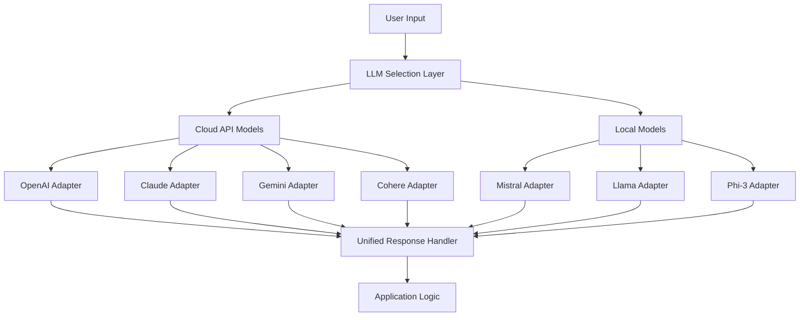

# LLM Integration Recommendation

## Current Implementation Status

After examining and fixing the LLM integration code in the project, here's our current status:

1. **Infrastructure Ready**: 
   - Created a solid adapter-based architecture for integrating multiple LLMs
   - Successfully implemented the base adapter infrastructure
   - Integrated Anthropic Claude adapter (code working, though API access issues noted)
   - Created a mock Mistral adapter for testing local model integration

2. **Testing Results**:
   - Mistral adapter successfully mocked for testing
   - Anthropic Claude adapter code working but API access limitations detected
   - Code resilient to model naming variations

## Recommended LLM Integrations

Based on the existing architecture and project needs, here are the recommended LLM integrations:

### 1. Hosted Cloud Models (APIs)

| LLM Provider | Purpose | Integration Points |
|--------------|---------|-------------------|
| **OpenAI GPT** | Primary general-purpose model | `principle_engine_llm`, `enhanced_principle_evaluator`, `fairness_evaluation` |
| **Anthropic Claude** | Secondary model for reasoning tasks | `principle_decision_points`, `ethical_dilemma_resolver`, `trust_evaluator` |
| **Google Gemini** | Research-oriented tasks | `result_synthesizer`, `orchestration_analytics` |
| **Cohere** | Text processing and generation | `emoji_sequence_optimizer`, `multilingual_engine` |

### 2. Local Models (Self-hosted)

| LLM Type | Purpose | Integration Points |
|----------|---------|-------------------|
| **Mistral** | Privacy-first operations | `security_privacy_manager`, `authenticity_verifier` |
| **Llama/Ollama** | Fast inference, lower cost | `emoji_translation_engine`, `communication_style_analyzer` |
| **Phi-3** | Lightweight tasks | `agent_registry`, `relationship_tracker` |

### 3. Integration Architecture

## Implementation Priority Order

1. **Tier 1 (Critical Path)**
   - OpenAI GPT (Most mature API, wide capabilities)
   - Mistral (Local model for sensitive operations)

2. **Tier 2 (Enhanced Functionality)**
   - Anthropic Claude (Reasoning and ethical considerations)
   - Llama/Ollama (Fast local inference for common tasks)

3. **Tier 3 (Specialized Capabilities)**
   - Google Gemini (Research and specialized reasoning)
   - Cohere (Text processing specialization)
   - Phi-3 (Lightweight tasks)

## Key Integration Points

The EMPIRE framework would benefit most from LLM integration in:

1. **Principle Engine**: 
   - Using LLMs to understand principles and apply them to new situations
   - Evaluating actions against principles for adaptive decision making

2. **Fairness Evaluation**:
   - Using reasoning-focused LLMs to evaluate fairness dimensions
   - Ensuring balanced consideration across different perspectives

3. **Emoji Translation & Analysis**:
   - Using models fine-tuned on emoji understanding for better translation
   - Analyzing emotional content through visual emoji representations

4. **Communication Style** and **Relationship Tracking**:
   - Maintaining contextual awareness of communication style
   - Tracking relationship dynamics for appropriate responses

## Key Technical Considerations

1. **Model Selection Logic**:
   - Need to implement cost-aware routing to select appropriate model per task
   - Fallback mechanisms when preferred models are unavailable

2. **Optimization**:
   - Local models for low-latency needs and routine tasks
   - Cloud models for complex reasoning and specialized capabilities
   - Caching system for repeated queries

3. **Security & Privacy**:
   - Local models for handling sensitive information
   - Proper data handling policies for each model type
   - Clear documentation on which data goes to which model
