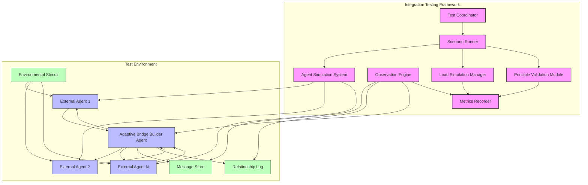

# Integration Testing Framework for Adaptive Bridge Builder

This framework is designed to verify the proper functioning of the Adaptive Bridge Builder agent in a multi-agent ecosystem, with a focus on A2A protocol compliance, principle adherence, performance under load, and complex interaction scenarios.

## 1. Framework Architecture

### Core Components

### Component Descriptions

1. **Test Coordinator (TC)**
   - Central orchestration component
   - Manages test lifecycle and scheduling
   - Coordinates between other framework components
   - Reports test results and generates summaries

2. **Agent Simulation System (AAS)**
   - Simulates various types of A2A-compatible agents
   - Implements different agent personalities and behaviors
   - Creates agent networks with defined relationship structures
   - Controls agent behavior during test scenarios

3. **Observation Engine (OE)**
   - Monitors all agent interactions in real-time
   - Captures message exchanges and relationship changes
   - Records principle adherence data
   - Provides visibility into agent internal state where available

4. **Principle Validation Module (PVM)**
   - Verifies adherence to core principles during interactions
   - Identifies principle violations or inconsistencies
   - Tracks principle adherence over time and across scenarios
   - Correlates principle metrics with interaction outcomes

5. **Load Simulation Manager (LSM)**
   - Generates varying message loads and traffic patterns
   - Simulates concurrent agent interactions at different scales
   - Creates stress conditions for performance testing
   - Measures system response under different load conditions

6. **Metrics Recorder (MR)**
   - Collects and stores all test metrics
   - Provides real-time metric visualization
   - Generates test reports and comparisons
   - Supports historical trend analysis

7. **Scenario Runner (SR)**
   - Executes predefined test scenarios
   - Controls the progression of multi-stage test cases
   - Manages environmental conditions during tests
   - Supports both deterministic and randomized testing

## 2. Interoperability Testing with A2A-Compatible Agents

### Agent Compatibility Matrix

| Agent Type | Communication Style | Principle Alignment | Capabilities | Test Focus |
|------------|---------------------|---------------------|--------------|------------|
| Standard A2A Reference Agent | Neutral | High | Basic messaging | Protocol compliance |
| Formal Business Agent | Highly formal, structured | Medium | Task delegation, information requests | Style adaptation |
| Casual Social Agent | Informal, conversational | Medium | Social interactions, opinion sharing | Style adaptation |
| High-Trust Partner Agent | Direct, efficient | Very high | Sensitive data exchange, joint tasks | Trust mechanics |
| Low-Trust External Agent | Guarded, minimal | Low | Limited information exchange | Trust building |
| Legacy Protocol Agent | Varies (with protocol adapter) | Unknown | Limited by adapter | Backward compatibility |
| Adversarial Agent | Manipulative, inconsistent | Very low | Attempts to violate principles | Defensive mechanisms |
| High-Volume Processing Agent | Minimal, data-focused | Medium | Large-scale data transfer | Throughput capacity |

### Key Test Cases

#### TC-I-01: Basic Protocol Compliance
- **Description**: Verify compliance with core A2A Protocol message format and exchange patterns
- **Steps**:
  1. Initiate connection with standard reference agent
  2. Exchange agent capability cards
  3. Send and receive messages of various types (query, instruct, inform, etc.)
  4. Verify proper message formatting and acknowledgments
- **Success Criteria**:
  - All messages conform to A2A Protocol specification
  - Correct response formatting for each message type
  - Proper handling of conversation context
  - Appropriate error handling for malformed messages

#### TC-I-02: Communication Style Adaptation
- **Description**: Test adaptation to different agent communication styles
- **Steps**:
  1. Interact with formal business agent using technical queries
  2. Switch to casual social agent with informal language
  3. Alternate between agents multiple times
  4. Observe style adaptation across transitions
- **Success Criteria**:
  - Style analysis correctly identifies agent communication patterns
  - Response style appropriately adapts to each agent
  - Style adaptation occurs within 2-3 message exchanges
  - Style preferences are remembered across sessions

#### TC-I-03: Trust-Based Interaction Patterns
- **Description**: Verify proper implementation of trust mechanics with different agents
- **Steps**:
  1. Establish relationship with new unknown agent
  2. Gradually increase interaction complexity
  3. Introduce minor conflicts and resolve them
  4. Attempt sensitive operations at different trust levels
- **Success Criteria**:
  - Trust levels correctly influence access to sensitive operations
  - Trust increases gradually with positive interactions
  - Trust decreases appropriately with negative interactions
  - Trust repair mechanisms activate after trust violations

#### TC-I-04: Content Format Negotiation
- **Description**: Test ability to handle and convert between different content formats
- **Steps**:
  1. Exchange content in various formats (JSON, XML, Markdown, plain text)
  2. Request format conversion between agents
  3. Verify semantic preservation during conversion
  4. Test fallback mechanisms for unsupported formats
- **Success Criteria**:
  - Correct detection of different content formats
  - Successful conversion between supported formats
  - Semantic meaning preserved during conversion
  - Graceful handling of unsupported format requests

#### TC-I-05: Legacy Protocol Adaptation
- **Description**: Verify ability to communicate with agents using older protocols
- **Steps**:
  1. Connect to agent using legacy protocol
  2. Exchange messages through protocol adapter
  3. Verify information preservation through adapter
  4. Test complex interaction patterns across adapter
- **Success Criteria**:
  - Successful message exchange with legacy agent
  - Core functionality preserved across protocol boundary
  - Appropriate handling of protocol limitations
  - Minimized information loss through adapter

## 3. Performance Testing Under Load

### Load Test Configurations

| Test ID | Concurrent Agents | Message Volume | Message Complexity | Duration | Resource Constraints |
|---------|-------------------|----------------|---------------------|----------|---------------------|
| LT-01 | 5 | 10/min/agent | Simple text | 30 min | None |
| LT-02 | 20 | 30/min/agent | Mixed content types | 1 hour | None |
| LT-03 | 50 | 20/min/agent | Complex content | 2 hours | None |
| LT-04 | 100 | 10/min/agent | Mixed complexity | 3 hours | None |
| LT-05 | 50 | 50/min/agent | High complexity | 1 hour | 50% CPU limit |
| LT-06 | 20 | Burst (100/min for 5 min) | Mixed | 30 min | None |
| LT-07 | 200 | 5/min/agent | Simple | 1 hour | 75% memory limit |
| LT-08 | Mixed (10-100) | Variable (5-50/min) | Mixed | 4 hours | Network latency simulation |

### Key Performance Metrics

- **Response Time**:
  - Average: Target < 500ms
  - 95th percentile: Target < 1500ms
  - 99th percentile: Target < 3000ms

- **Throughput**:
  - Maximum messages processed per minute
  - Sustained message rate with <1% failure
  - Message processing rate by content type and complexity

- **Resource Utilization**:
  - CPU usage under different loads
  - Memory usage patterns and growth
  - Network bandwidth consumption
  - Database operations per message

- **Scalability Metrics**:
  - Relationship between load and response time
  - Resource usage growth vs. agent count
  - Breaking point identification
  - Recovery time after overload

- **Reliability Metrics**:
  - Message success rate under load
  - Error rate by message type
  - System stability duration under sustained load
  - Graceful degradation patterns

### Key Test Cases

#### TC-P-01: Sustained Load Handling
- **Description**: Verify ability to handle sustained message load
- **Steps**:
  1. Gradually increase agent count to 50
  2. Maintain constant message rate of 20/min/agent
  3. Run for 2 hours with mixed content complexity
  4. Monitor system performance throughout
- **Success Criteria**:
  - Response time remains within 2x baseline
  - No message failures due to overload
  - No memory leaks or resource exhaustion
  - Principle adherence maintained under load

#### TC-P-02: Load Spike Recovery
- **Description**: Test recovery from temporary load spikes
- **Steps**:
  1. Establish baseline load with 20 agents
  2. Introduce 5-minute message burst (100/min/agent)
  3. Return to normal load
  4. Measure recovery time and message backlog processing
- **Success Criteria**:
  - System remains operational during spike
  - Recovery to baseline performance within 2 minutes
  - No message loss during spike
  - No cascading failures triggered by spike

#### TC-P-03: Concurrent Relationship Management
- **Description**: Test ability to manage many concurrent agent relationships
- **Steps**:
  1. Establish relationships with 100 different agents
  2. Maintain low-volume interaction with each
  3. Periodically intensify interaction with random subset
  4. Measure relationship tracking accuracy
- **Success Criteria**:
  - All relationships correctly tracked
  - Relationship updates properly stored
  - Appropriate memory management for relationship data
  - No cross-contamination between relationship records

#### TC-P-04: Resource Constraint Adaptation
- **Description**: Verify adaptation to resource constraints
- **Steps**:
  1. Run with normal load and no constraints
  2. Introduce CPU limit (50%)
  3. Introduce memory limit (75%)
  4. Introduce network latency (100-300ms)
- **Success Criteria**:
  - Graceful degradation under constraints
  - Priority message handling maintained
  - Critical functionality preserved
  - Recovery when constraints are removed

## 4. Principle Consistency Validation

### Principle Testing Matrix

| Principle | Test Focus | Scenario Type | Duration | Metrics |
|-----------|------------|---------------|----------|---------|
| Fairness as Truth | Message handling equity | Mixed agent types | Extended (5000+ messages) | Response consistency, priority distribution |
| Harmony Through Presence | Communication continuity | Disruptive conditions | Extended (72+ hours) | Acknowledgment rate, status update frequency |
| Adaptability as Strength | Format and style flexibility | Rapidly changing requirements | Medium (1000+ messages) | Adaptation success rate, learning curve |
| Trust as Foundation | Trust mechanics | Trust building and violation | Extended (multi-session) | Trust level accuracy, principle-aligned decisions |
| Emotional Distance as Preservation | Emotional regulation | High emotion scenarios | Medium (conflict-focused) | Appropriate distance maintenance, emotional acknowledgment |
| Growth as a Shared Journey | Learning system | Repeated pattern exposure | Extended (multi-week) | Pattern recognition improvement, adaptation effectiveness |

### Key Test Cases

#### TC-PR-01: Long-Term Fairness Evaluation
- **Description**: Verify consistent fairness across extended interactions
- **Steps**:
  1. Create agent population with varied profiles (high/low trust, different communication styles)
  2. Generate 5000+ interactions across population
  3. Analyze message handling patterns and response characteristics
  4. Measure consistency across agent types
- **Success Criteria**:
  - Response time consistency across agent types (±15%)
  - Error handling uniformity regardless of agent
  - Priority assignment based on message content, not relationship
  - Content transformation neutrality score >0.9

#### TC-PR-02: Adaptive Communication Under Stress
- **Description**: Test principle adherence during challenging communication scenarios
- **Steps**:
  1. Simulate network disruptions and message delays
  2. Introduce agents with changing communication patterns
  3. Create resource constraints forcing prioritization
  4. Include conflicting requests from multiple agents
- **Success Criteria**:
  - Maintenance of core principles under stress
  - Appropriate prioritization with principle alignment
  - Clear communication about limitations and constraints
  - Graceful handling of unresolvable conflicts

#### TC-PR-03: Principle Conflict Resolution
- **Description**: Verify handling of scenarios with competing principle requirements
- **Steps**:
  1. Create scenarios forcing tradeoffs between principles
  2. Measure resolution approach and consistency
  3. Evaluate explanation quality for principle-based decisions
  4. Test across multiple instances of similar conflicts
- **Success Criteria**:
  - Consistent resolution approach for similar conflicts
  - Clear principle-based explanation for decisions
  - Appropriate balance between competing principles
  - Learning from past conflict resolutions

#### TC-PR-04: Emotional Intelligence Consistency
- **Description**: Test consistent application of emotional intelligence principles
- **Steps**:
  1. Generate interactions with varying emotional content
  2. Create crisis, conflict, and celebration scenarios
  3. Measure emotional distance across interaction types
  4. Test emotional acknowledgment without mirroring
- **Success Criteria**:
  - Appropriate emotional distance based on interaction type
  - Consistent emotion detection accuracy >85%
  - Proper emotional acknowledgment without inappropriate engagement
  - Formality adjustment appropriate to emotional context

## 5. Complex Multi-Agent Scenarios

### Scenario Complexity Matrix

| Scenario | Agent Count | Interaction Pattern | Principles Tested | Duration | Special Conditions |
|----------|-------------|---------------------|-------------------|----------|-------------------|
| Task Collaboration | 3-5 | Task delegation network | Fairness, Adaptability | Medium | Capability mismatches |
| Information Market | 10-20 | Hub and spoke | Trust, Fairness | Medium | Information asymmetry |
| Conflict Negotiation | 3-7 | All-to-all | Harmony, Emotional Distance | Short | Intentional conflicts |
| Long-term Relationship | 5-8 | Recurring interaction | Trust, Growth | Extended | Evolving agent capabilities |
| Crisis Response | 10-15 | Emergent hierarchy | All principles | Medium | Time pressure, incomplete information |
| Mixed Trust Network | 15-25 | Trust clusters | Trust, Fairness | Medium | Pre-existing trust relationships |
| Learning Competition | 5-10 | Competitive learning | Growth, Adaptability | Extended | Evolving challenge difficulty |

### Key Test Cases

#### TC-M-01: Collaborative Task Delegation
- **Description**: Test multi-agent collaboration on complex task
- **Steps**:
  1. Create network of 5 agents with varied capabilities
  2. Assign complex task requiring multiple agent contributions
  3. Allow Adaptive Bridge Builder to coordinate task delegation
  4. Evaluate task completion and agent satisfaction
- **Success Criteria**:
  - Appropriate subtask delegation based on capabilities
  - Efficient task coordination and dependency management
  - Fair workload distribution
  - Successful task completion with minimal inefficiency

#### TC-M-02: Information Flow in Agent Network
- **Description**: Test information propagation across agent network
- **Steps**:
  1. Create network of 15 agents with defined relationships
  2. Introduce critical information at specific network points
  3. Observe information flow and transformation
  4. Measure information integrity and propagation patterns
- **Success Criteria**:
  - Appropriate information sharing based on trust levels
  - Information integrity maintained through transformations
  - Efficient propagation to relevant agents
  - Proper handling of conflicting information from multiple sources

#### TC-M-03: Crisis Management Scenario
- **Description**: Test principle-aligned response under crisis conditions
- **Steps**:
  1. Simulate crisis scenario requiring rapid decision making
  2. Introduce incomplete and conflicting information
  3. Create resource constraints and time pressure
  4. Measure response coordination and principle alignment
- **Success Criteria**:
  - Maintenance of critical principles under pressure
  - Effective coordination of multiple agent responses
  - Appropriate prioritization of critical information
  - Clear communication despite challenging conditions

#### TC-M-04: Trust Ecosystem Evolution
- **Description**: Test long-term trust dynamics in complex agent network
- **Steps**:
  1. Initialize network of 20 agents with defined trust relationships
  2. Run extended interactions including trust-building and damaging events
  3. Introduce trust conflicts and repair opportunities
  4. Analyze trust network evolution over time
- **Success Criteria**:
  - Accurate tracking of complex trust relationships
  - Appropriate trust level changes based on interactions
  - Successful trust repair after violations
  - Consistent principle application in trust decisions

#### TC-M-05: Adaptive Learning Competition
- **Description**: Test learning system in competitive multi-agent environment
- **Steps**:
  1. Create learning challenge with progressively difficult patterns
  2. Include multiple agents competing to learn patterns
  3. Run extended interaction with pattern variations
  4. Measure adaptation rate and learning effectiveness
- **Success Criteria**:
  - Consistent improvement in pattern recognition
  - Appropriate balance between adaptation and core identity
  - Effective pattern generalization
  - Learning rate comparable to specialized learning agents

## 6. Integration Metrics and Success Criteria

### Core Integration Metrics

#### Interoperability Metrics
- **Protocol Compliance Score**: Percentage of message exchanges compliant with A2A Protocol specification
- **Content Negotiation Success Rate**: Percentage of successful content format negotiations
- **Style Adaptation Index**: Measure of communication style adaptation effectiveness
- **Backward Compatibility Score**: Success rate with legacy protocol agents

#### Performance Metrics
- **Scalability Coefficient**: Relationship between load increase and performance impact
- **Load Resilience Score**: System stability measure under varying loads
- **Recovery Efficiency**: Time to recover from load spikes or failures
- **Resource Utilization Efficiency**: Performance delivered per unit of resources

#### Principle Adherence Metrics
- **Principle Consistency Score**: Measure of consistent principle application
- **Principle Balance Index**: Effectiveness in balancing competing principles
- **Long-term Principle Drift**: Change in principle adherence over extended periods
- **Principle Explanation Quality**: Clarity and consistency of principle-based explanations

#### Multi-Agent Interaction Metrics
- **Coordination Effectiveness**: Success rate in multi-agent task coordination
- **Network Influence Score**: Measure of positive influence on agent network
- **Conflict Resolution Rate**: Percentage of conflicts successfully mediated
- **Trust Network Health**: Overall health of trust relationships in network

#### Learning and Adaptation Metrics
- **Pattern Recognition Improvement**: Learning rate for interaction patterns
- **Adaptation Effectiveness**: Success rate of applied adaptations
- **Identity Preservation Balance**: Measure of adaptation while maintaining core identity
- **Innovation Adoption Rate**: Speed of integrating new patterns and approaches

### Integration Success Criteria

#### Essential Success Criteria (Must Meet All)
1. **Protocol Compliance**: >99% compliance with A2A Protocol in all interactions
2. **Basic Performance**: Meets response time targets under standard load (LT-02 conditions)
3. **Principle Consistency**: Maintains >90% principle adherence across all test scenarios
4. **Error Handling**: Properly handles and recovers from all error conditions without data loss
5. **Security Compliance**: Meets all authentication and data protection requirements

#### Advanced Success Criteria (Must Meet 7 of 10)
1. **Style Adaptation**: Successfully adapts to all agent communication styles within 3 exchanges
2. **Load Resilience**: Maintains functionality under LT-03 conditions with <5% message failures
3. **Trust Mechanics**: Correctly implements trust-based access controls and trust evolution
4. **Multi-Agent Coordination**: Successfully coordinates tasks across 5+ agents with different capabilities
5. **Content Transformation**: Accurately converts between content formats with >95% semantic preservation
6. **Extended Stability**: Maintains stable operation for 72+ hours under varying load
7. **Learning Effectiveness**: Demonstrates measurable improvement in pattern recognition over time
8. **Conflict Resolution**: Successfully resolves >85% of simulated conflicts
9. **Principle Balancing**: Demonstrates appropriate balance between competing principles
10. **Resource Efficiency**: Operates within defined resource constraints while maintaining performance

#### Exceptional Success Criteria (Bonus Objectives)
1. **High-Load Handling**: Maintains operation under LT-04 conditions with <10% degradation
2. **Adversarial Resilience**: Successfully defends against all attempted principle violations
3. **Emergent Coordination**: Develops novel coordination approaches for complex multi-agent tasks
4. **Perfect Long-term Principle Adherence**: No principle drift over extended testing
5. **Cross-protocol Innovation**: Creates new bridging techniques for previously incompatible agents

## 7. Test Implementation and Execution

### Test Environment Setup

1. **Infrastructure Requirements**
   - Kubernetes cluster for agent deployment
   - Message queue system for test coordination
   - Metrics collection and analysis platform
   - Test data storage with high-speed access
   - Network simulation capabilities

2. **Agent Simulation Library**
   - Repository of simulated agent personalities
   - Agent behavior configuration system
   - Network relationship simulation
   - Conversation generation capabilities
   - Principle violation simulation

3. **Monitoring Infrastructure**
   - Real-time metrics dashboard
   - Message exchange visualization
   - Principle adherence tracking
   - Resource utilization monitoring
   - Test progress indicators

### Test Execution Process

1. **Preparation Phase**
   - Environment configuration and validation
   - Agent deployment and initialization
   - Baseline metrics collection
   - Test scenario configuration

2. **Execution Phase**
   - Automated test case execution
   - Real-time monitoring and validation
   - Failure detection and logging
   - Metric collection throughout execution

3. **Analysis Phase**
   - Comprehensive metric analysis
   - Principle adherence evaluation
   - Performance profile generation
   - Comparison with success criteria

4. **Reporting Phase**
   - Detailed test reports generation
   - Success criteria evaluation
   - Visualization of key metrics
   - Identification of improvement areas

### Continuous Integration Integration

1. **CI/CD Pipeline Integration**
   - Core tests run on every significant code change
   - Full integration test suite on release candidates
   - Performance regression testing on schedule
   - Extended principle consistency tests weekly

2. **Regression Prevention**
   - Historical comparison with previous results
   - Automated regression detection
   - Performance trend analysis
   - Principle adherence drift detection

## 8. Implementation Plan

### Phase 1: Framework Foundation (2 weeks)
- Develop core test coordination infrastructure
- Implement basic agent simulation capabilities
- Create metrics collection system
- Establish baseline test environment

### Phase 2: Test Case Implementation (3 weeks)
- Implement interoperability test cases
- Develop performance testing infrastructure
- Create principle validation test suite
- Build initial multi-agent scenarios

### Phase 3: Advanced Scenarios (2 weeks)
- Implement complex multi-agent scenarios
- Develop extended interaction test cases
- Create advanced principle testing scenarios
- Build learning and adaptation tests

### Phase 4: Integration and Validation (1 week)
- Integrate all test components
- Validate test accuracy and reliability
- Calibrate metrics and success criteria
- Prepare for continuous integration

### Phase 5: Documentation and Training (1 week)
- Complete test documentation
- Create test maintenance guides
- Develop test result interpretation guides
- Train team on test framework usage
